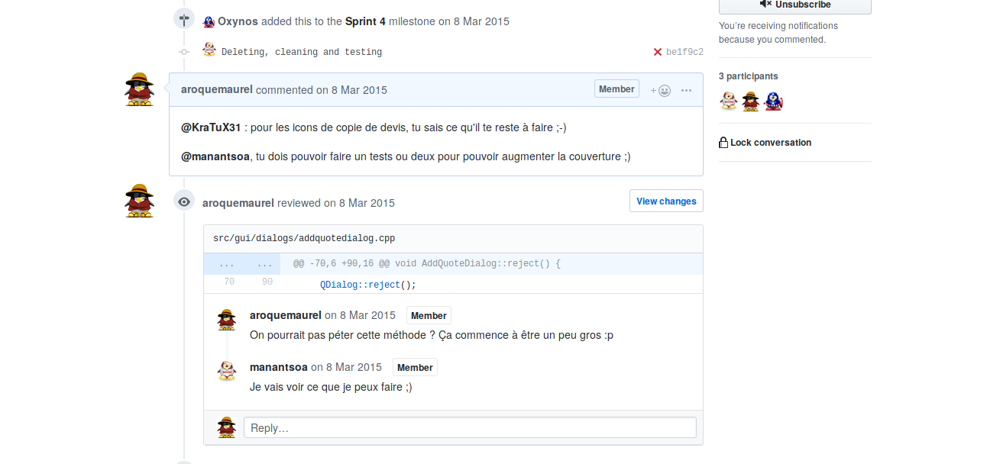

Pour commencer, une petit définition de la revue de code sur Wikipédia : 

> La **revue de code** (de l'anglais *code review*) est un examen systématique du [code source](https://fr.wikipedia.org/wiki/Code_source) d'un logiciel. 
>
> Il peut être comparé au processus ayant lieu dans un [comité de lecture](https://fr.wikipedia.org/wiki/Comit%C3%A9_de_lecture), l'objectif étant de trouver des [bugs](https://fr.wikipedia.org/wiki/Bug_informatique)  ou des vulnérabilités potentielles ou de corriger des erreurs de  conception afin d'améliorer la qualité, la maintenabilité et la sécurité  du logiciel. 
>
> Source: https://fr.wikipedia.org/wiki/Revue_de_code

Le principe est assez simple, un autre regard sur notre travail est en général assez bénéfique. Chaque développeur, et plus généralement chaque personne, a une façon différente de penser, d’appréhender un problème. Un autre regard peut donc amener une autre approche. 

La revue de code se fait de plus en plus régulièrement dans des entreprises de différentes tailles, aussi bien dans des petites startup de quelques développeurs que dans des mastodontes tel que le [Google](https://www.quora.com/What-is-Googles-internal-code-review-policy-process) ou le projet [Linux](https://github.com/torvalds/linux/pulls) par exemple. 

# Qui peut relire le code

Il y a deux écoles ici, les deux ont pour moi leurs avantages et leurs inconvénients. 

Un développeur expérimenté, tel que le *lead dev* va relire l'ensemble du code de l'équipe. Le principal avantage de cette technique c'est que c'est en général le développeur ayant la meilleure connaissance de l'application et du métier. Il sera donc plus à même de relire le code de l'équipe. L'inconvénient, c'ets que cette connaissance de l'application restera au sein de la même personnes, si un jour ce développeur est absent cela peut être dommageable pour le projet. C'est actuellement mon rôle. 

Il est également possible de faire tourner le relecteur, chaque personne sera amené à lire le code d'un autre développeur. Le gros avantage c'est que ça responsabilise le développeur, et permet de faire monter en compétence l'ensemble de l'équipe. De plus, cela permet de partager la connaissance du projet. Sur mon poste, j'ai une vision globale du projet alors que les autres développeurs sont en général cantonné à leur propres développements. En revanche, cela peut être assez difficile à mettre en place au début, car justement le reste de l'équipe n'a pas nécessairement une vision d'ensemble. Cependant cela peut-être l'occasion de faire monter progressivement toute l'équipe en compétence.

# Comment faire une revue de code

Il y a plusieurs manières d'aborder une revue de code, et celle-ci dépends principalement du contexte du projet et de la culture de l'entreprise. En voici quelques exemples : 

- Les Pull ou Merge requests : ce sont des méthodes très utilisés dans le monde du libre notamment au travers de [Github](https://github.com/) ou [Gitlab](https://gitlab.com/). Un développeur envoie ses changements, et une autre personne valide, et intègre le moment venu. 
- « Analyse par-dessus l'épaule » : Deux personnes sont devant l'ordinateur, l'auteur commente son code, et la seconde personne donne éventuellement des conseils ou pose des questions.
- « Programmation en binôme » : la programmation en binôme repose sur le même principe. Une personne code pendant que la seconde est plus a même de commenter ou poser des questions sur le code. 
- La revue de code par mail : c'est un technique qui avait court avant la démocratisation des outils, mais il est possible de faire une liste de diffusion, et de s'envoyer des patchs par mail. La relecture se faisant directement par retours de mails. 

